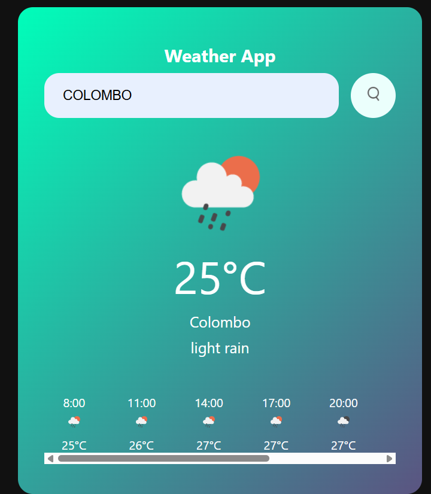

# Weather App

A simple weather application that displays the current weather and a 24-hour forecast for any city. The app fetches data from the OpenWeatherMap API and presents it in a user-friendly interface.

## Features

- Search for current weather by city name.
- Display of the current temperature, weather description, and weather icon.
- Display of hourly forecasts for the next 24 hours in 3-hour intervals.
- Responsive design with dynamic updates when a new city is searched.

## Technologies Used

- HTML
- CSS
- JavaScript
- OpenWeatherMap API

## Setup and Installation

Follow these steps to set up the project:

1. **Clone the repository:**

   ```bash
   git clone https://github.com/your-username/weather-app.git
   cd weather-app
   ```

2. **Open the project:**

   Simply open the `index.html` file in your browser or use a local development server.

3. **Get an API key from OpenWeatherMap:**

   - Sign up for an account at [OpenWeatherMap](https://openweathermap.org/).
   - Go to the "API keys" section and generate a new API key.

4. **Add the API key:**

   - Open the `script.js` file and replace the `apiKey` variable with your own API key:

     ```javascript
     const apiKey = 'YOUR_API_KEY_HERE';
     ```

5. **Run the app:**

   Open `index.html` in your browser and start searching for cities to view weather data.

## Usage

1. Enter the name of a city in the search box.
2. Click the **Search** button to fetch and display the current weather and hourly forecast.
3. The current weather will show the temperature, weather description, and an icon.
4. The hourly forecast will display the weather for the next 24 hours (in 3-hour intervals).

## File Structure

```
weather-app/
├── index.html       # The main HTML file for the app
├── style.css        # The main CSS file for styling the app
└── script.js        # JavaScript file containing the weather data fetching logic
```

## Error Handling

- If the city is not found, the app will display an error message.
- If there are issues with the API (e.g., incorrect API key), appropriate error messages are shown in the console and an alert is triggered.

## Screenshots


